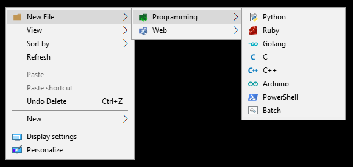
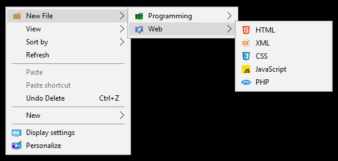
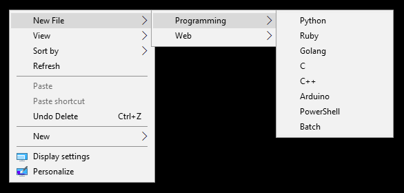
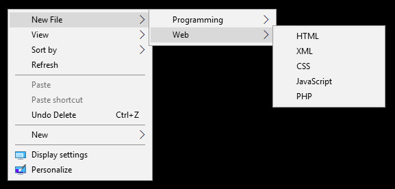

# NewCascadingContextMenu
"**New**" Custom Cascading Context Menu (Quick and Easy Template/File Creating)

## [EN] :man_shrugging:
This project was created to reduce the time waste of creating too many test files. If you want, you can edit the files in the Template folder and create your own template in the programming language you want.

## [TR] :man_shrugging:
Bu proje çok fazla test dosyası oluşturmanızdaki zaman kaybını azaltmak için oluşturulmuştur. İsterseniz Template klosörü içindeki dosyaları düzenleyerek istediğiniz programlama dilinde kendi şablonunuzu oluşturabilirsiniz.

-------------

**With Icons**

**Without Icons**

-------------

## [EN] Install 
* Copy **NewCascadingContextMenu** folder to your **Windows** directory. (`` C:\Windows\NewCascadingContextMenu ``)
* Run ``install_with_icons.reg`` or ``install_without_icons.reg`` (Run install_with_icons.reg file if you want with icons, install_without_icons.reg file if you want without icon.) 
* **Note:** Just run one.

## [TR] Kurulum 
* **NewCascadingContextMenu** dosyasını **Windows** dizininin altına kopyalayın. (`` C:\Windows\NewCascadingContextMenu ``).
* ``install_with_icons.reg`` veya ``install_without_icons.reg`` dosyasını çalıştırın. (Iconlu isterseniniz **install_with_icons.reg** dosyasını, iconsuz halde isterseniz **install_without_icons.reg** dosyasını çalıştırın.) 
* **Not:** Sadece birini çalıştırın.

-------------

## [EN] Uninstall 
* Run the `uninstall.reg` file.  

## [TR] Kaldır 
* `uninstall.reg` dosyasını çalıştırın.